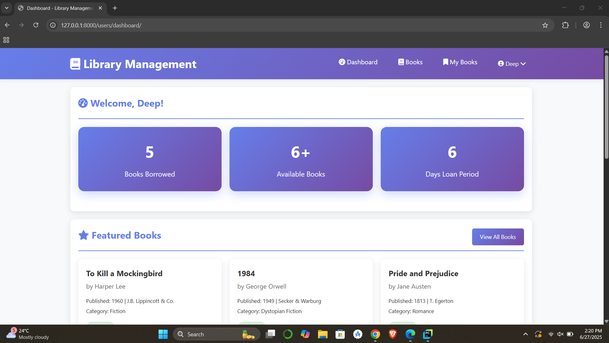
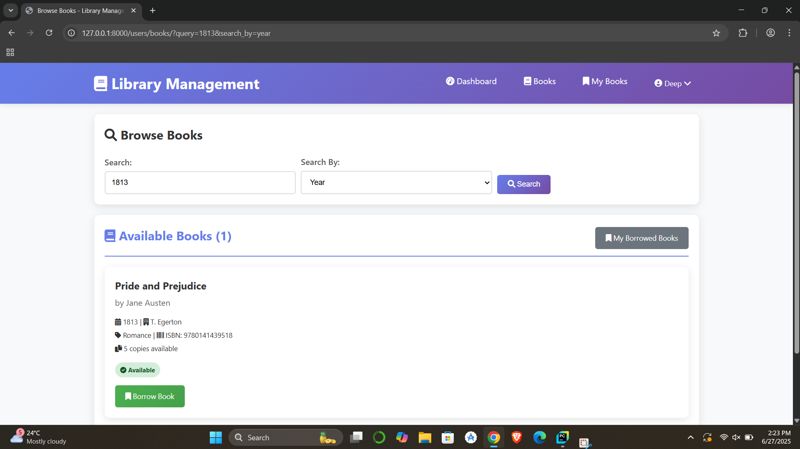

<div align="center">

# 📚 Online Bookstore / Library Management System


**An intuitive Django-based platform for managing book inventories, borrowing systems, and users in libraries or educational institutions.**

</div>

---

## 📋 Table of Contents

- [🌟 Features](#-features)
- [🚀 Quick Start](#-quick-start)
- [📸 Screenshots](#-screenshots)
- [🛠️ Tech Stack](#-tech-stack)
- [📁 Project Structure](#-project-structure)
- [📞 Contact](#-contact)

---

## 🌟 Features

### For General Users (Students/Readers)
- 🔒 Secure registration and login
- 🔍 Search and filter books by title, author, or year
- 📚 View available books and personal borrowing history
- 📅 Borrow books and receive return reminders

### For Admins (Librarians)
- 📘 Add, edit, or remove books
- 👥 Manage users with role assignments
- 📊 Track borrow/return transactions
- 📄 Export/import data, generate reports

---

## 🚀 Quick Start

### ✅ Prerequisites
- Python 3.8+
- pip
- SQLite (preinstalled with Python)
- Git

### 🧑‍💻 Local Installation

```bash
# Clone the repository
git clone https://github.com/your-username/library-management-system.git
cd library-management-system

# Create virtual environment
python -m venv venv
source venv/bin/activate  # Windows: venv\Scripts\activate

# Install dependencies
pip install -r requirements.txt

# Database setup
python manage.py makemigrations
python manage.py migrate

# Create admin user
python manage.py createsuperuser

# (Optional) Load sample data
python manage.py loaddata sample_books.json

# Run the server
python manage.py runserver
```
### 🚀 Launch the Project

Visit [http://127.0.0.1:8000](http://127.0.0.1:8000) to explore!


## 📸 Screenshots

<details>
<summary>🖥️ <strong>Desktop Views</strong></summary>

### 🧑‍🎓 User Dashboard


### ⚙️ Admin Panel


### 🔍 Book Search


</details>

---

## 🛠️ Tech Stack

| Layer           | Technology            |
|----------------|------------------------|
| Backend         | Django (Python)        |
| Frontend        | HTML, CSS, Bootstrap   |
| Database        | SQLite3                |
| Authentication  | Django Auth            |
| Deployment      | Localhost / PythonAnywhere / Heroku (optional) |

---

## 📁 Project Structure

```plaintext
library-management-system/
│
├── library_app/             # Main Django app
│   ├── migrations/          
│   ├── static/              # CSS, JS, images
│   ├── templates/           # HTML templates
│   ├── admin.py
│   ├── models.py            # DB schema
│   ├── views.py
│   └── urls.py
│
├── db.sqlite3               # Default database
├── manage.py
├── requirements.txt
└── README.md
  ```
---

📞 Contact
👨‍💻 Developers: Deepkumar Patel & Deep Jasani & Het Anghan & Sohil Pansuriya
